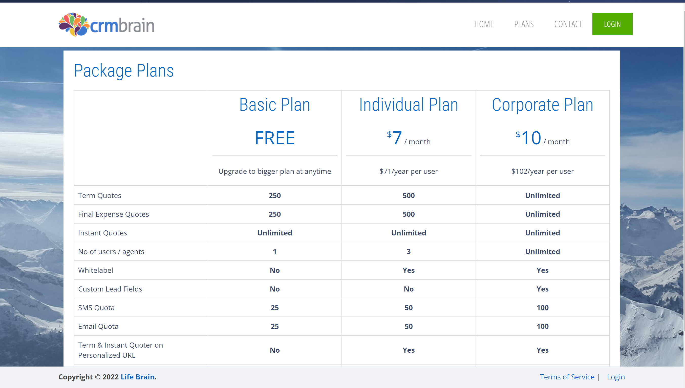
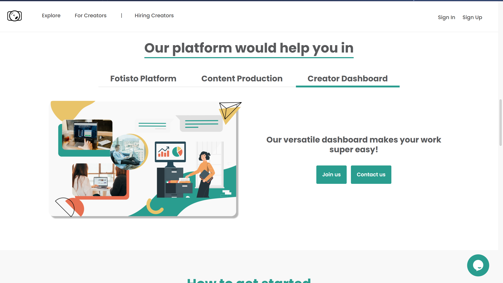

# ASP.NET
  .NET Framework is the best way to create Dynamic Web Application developed by Microsoft. We can scaffold the project in many ways possible either Code first approach or Database first approach.

## Projects in .NET
  I have worked on many ASP.NET Projects that are live and working properly. You can view some of my live projects:
  
  1. CRM LifeBrain Project
     - I have worked as a Frontend Developer and partial backend developer in this project with the team. I was given different tasks to proceed with and had learned many things in it. The project is running on .Net Core 2.1 Version.
     - This is the crm that is developed for a company that manages different insurance companies that is accessed by different agents to sell the insurance policies to their customers which in refereal to them adds up the agents lead for that specific insurace policy of that insurance companies. Overall, it is a digital platform for the USA Persons to buy and sell insurances policies of almost all the insurance companies by online agents.  
     
     https://crmbrain.io/

  2. Fotisto Content Creation Project
     - I have worked as a Software Engineer in this project under the guiance of the seniors of this project. I was mostly responsible for handling dashboard and other tasks related to annonymous interface of the users. 
     - The Project creates a good communication with data between the client and the professional where the professional can create the work portfolio and the client can create a project and in it, the user can hire professionals for different events.
     
     https://dev.fotisto.co/#
  
  3. Financial Solution
     - I am currently working as a Frontend Developer in this project for a local body.

## Note
   I Push my experiement Projects on Github for safe records and to relearn my experiemtns again in the near future.
